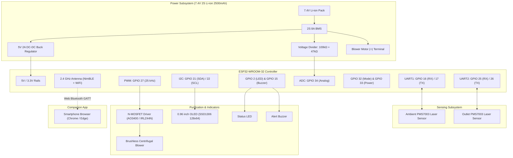

# SMART AIR-SHIELD Hardware Wiring Diagram & Pinout Specification

This document provides the complete hardware wiring reference for the SMART AIR-SHIELD prototype based on the ESP32-WROOM-32 microcontroller.

---

## 1. Complete Pinout Table

| Peripheral | ESP32 GPIO | Direction | Protocol / Type | Connection / Notes |
| :--- | :--- | :--- | :--- | :--- |
| **Ambient PMS7003** (RX) | GPIO 17 | Output (ESP32 TX) | UART1 TX (9600 baud) | Connected to PMS7003 Pin 4 (RXD) |
| **Ambient PMS7003** (TX) | GPIO 16 | Input (ESP32 RX) | UART1 RX (9600 baud) | Connected to PMS7003 Pin 5 (TXD) |
| **Outlet PMS7003** (RX) | GPIO 26 | Output (ESP32 TX) | UART2 TX (9600 baud) | Connected to PMS7003 Pin 4 (RXD) |
| **Outlet PMS7003** (TX) | GPIO 25 | Input (ESP32 RX) | UART2 RX (9600 baud) | Connected to PMS7003 Pin 5 (TXD) |
| **OLED SSD1306** (SDA) | GPIO 21 | Bidirectional | I2C Data (400 kHz) | Connects to OLED SDA pin |
| **OLED SSD1306** (SCL) | GPIO 22 | Output (Clock) | I2C Clock (400 kHz) | Connects to OLED SCL pin |
| **Blower PWM Driver** | GPIO 27 | Output | PWM (25 kHz, 10-bit) | Connects to N-MOSFET Gate via 100Ω |
| **Mode Button** | GPIO 32 | Input (Pull-up) | Digital GPIO | Push button to GND with 50ms debounce |
| **Power Button** | GPIO 33 | Input (Pull-up) | Digital GPIO | Push button to GND with 50ms debounce |
| **Status LED** | GPIO 2 | Output | Digital GPIO | High = ON; 220Ω series resistor to GND |
| **Buzzer** | GPIO 15 | Output | Digital GPIO / PWM | 2N2222 or direct buzzer to GND |
| **Battery ADC** | GPIO 34 | Input (ADC1_CH6) | Analog (0–3.3V) | Midpoint of 100kΩ / 47kΩ divider from 7.4V |

---

## 2. Mermaid System Interconnect Diagram



---

## 3. Circuit Schematics

### 3.1 Blower Low-Side MOSFET Driver
```text
  +7.4V Battery Pack (via BMS)
         │
         ▼
     ┌───────┐
     │ BLOWER│ (Centrifugal Brushless Blower 5V/12V)
     └───┬───┘
         │
         ├───[ Flyback Diode 1N4007 / 1N5819 (Cathode to +7.4V) ]
         │
       │▀ D
  GPIO27 ──[100Ω]──┤  N-Channel MOSFET (IRLZ44N or AO3400)
                   │▄ S
         │          │
       [10kΩ]      GND
         │
        GND (Pull-down)
```

### 3.2 Battery Voltage Divider (2S Li-ion 6.0V to 8.4V)
```text
  +7.4V (Pack +) ──[ R1: 100 kΩ ]──┬──[ R2: 47 kΩ ]── GND
                                    │
                                    └───► To ESP32 GPIO 34 (ADC1_CH6)

  Formula: V_ADC = V_BAT * (47 / (100 + 47)) = V_BAT * 0.3197
  At V_BAT = 8.4V max: V_ADC = 2.685 V (Safely below 3.3V ADC full-scale)
  At V_BAT = 6.0V cutoff: V_ADC = 1.918 V
```

### 3.3 Tactile Buttons
```text
  ESP32 GPIO 32 ──[ Tactile Mode Switch ]── GND   (Internal pull-up enabled)
  ESP32 GPIO 33 ──[ Tactile Power Switch ]── GND  (Internal pull-up enabled)
```

---

## 4. Bench Testing & Breadboard Assembly Notes
1. **Common Ground**: Ensure the ESP32 GND, PMS7003 GND, Blower GND, and Battery BMS GND are all connected to a common ground bus.
2. **PMS7003 Power**: Plantower PMS7003 requires 5V power (Pin 1 & 2) for its internal laser diode and mini fan, while its UART logic levels (Pin 4 & 5) operate safely with ESP32 3.3V logic.
3. **PWM Frequency**: The 25 kHz PWM frequency configured in `config.h` avoids the audible human hearing range (20 Hz - 20 kHz), ensuring virtually silent operation of the MOSFET gate.
